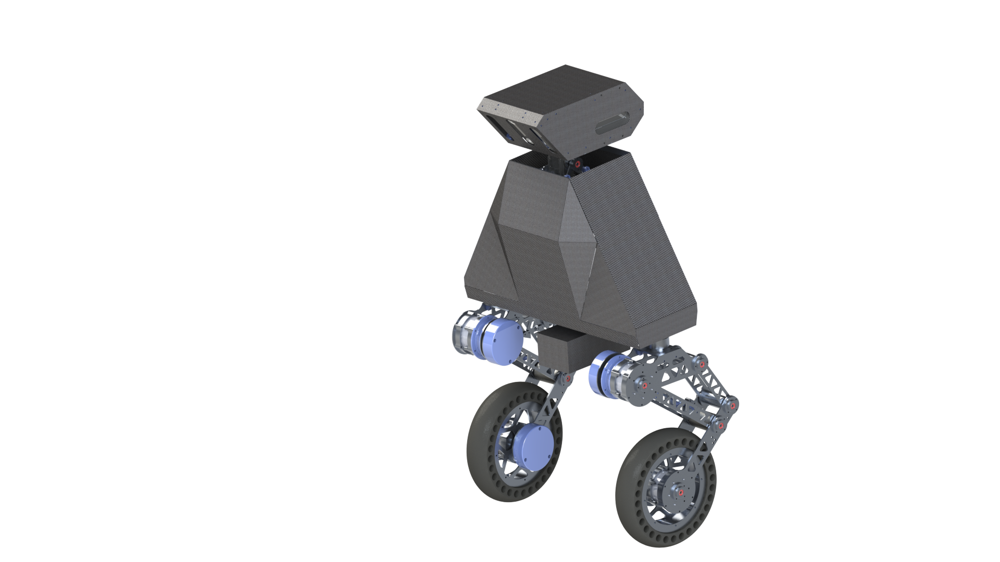
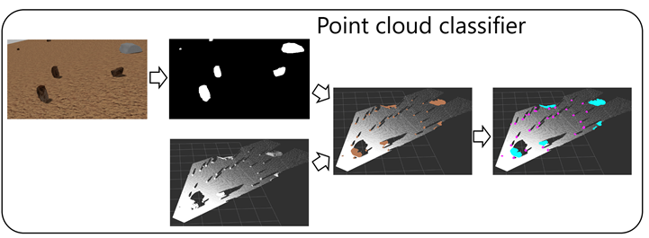

# point_cloud_classifier package
This is the point cloud classification package developed for the two-wheeled
mobile robot. I developed this package to analyze environment cluttered
with various obstacles, for example Mars surface. I developed a computer
system and trained a neural network to segment stones that the robot can
encounter on Mars surface. These stones can be dangerous obstacles for the
robot as these can damage the robot's wheels. Some stones are small enough to
be passed between the robot's legs (these are passable obstacles). Other are
too big (these are unpassable obstacles).
The developed computer vision system classifies point cloud received from
camera, detects obstacles and classifies these as passable and unpassable.

<figure>
    
    <div style="text-align: center;">
        <figcaption>Two wheeled robot</figcaption>
    </div>
</figure>

## Point cloud classification algorithm
<figure>
    
    <div style="text-align: center;">
        <figcaption>Point cloud classification algorithm</figcaption>    
    </div>
</figure>

The algorithm works as follows:
1. a robot's cameras sends images to the system
2. a convolutional neural network performs instance segmentation of the images.
Each pixel is labeled as stone or environment class.
3. the package back-projects the segmented images on point cloud from the
cameras, the points are labeled according to the pixels these were projected on.
4. the system estimates dimensions of each stone instance using the stones
points coordinates. The system compares the stone dimensions with a
threshold and classifies these as passable and unpassable obstacles.

The output is point cloud labeled according to three classes (environment,
passable obstacle and unpassable obstacle)

## The package description
The point_cloud_classifier package initializes the "point_cloud_classifier"
node. Its input topics are:
1. "/d435_i/color/image_raw" (accepts RGB images)
2. "/d435_i/aligned_points" (accepts point cloud messages)
3. "/d435_i/color/camera_info" (accepts information required for point cloud
back projection)
4. "/cam_base_i" (accepts odometry information for coordinates transformation
from camera frame to robot's base frame)
5. "/cam_map_i" (accepts odometry information for coordinates transformation
from camera frame to map's frame)

i - is the camera's index. If you want to process messages from two cameras
you should launch two "point_cloud_classifier" nodes. If you launch one node
i=1 for this node. If you launch two nodes, i=1 for the first node and i=2
for the second node.

The output topic is "/labeled_points". It publishes PointList messages that
have the following structure:
```
Header header
sensor_msgs/PointCloud2 point_cloud
TF tf
int16[] labels
```
- Header is used for time synchronisation between two cameras
- PointCloud2 is the point cloud accepted by the package
- TF is a message using for required coordinates transformation
- int16[] is an array containing labels of the points in segmented point cloud

TF hase the following structure:
```
float64[] position
float64[] orientation
```
float64[] are arrays containing position and orientation of one frame in
another frame

Also, the package can work in training mode (training of the neural network
on some dataset), and generate from the original images with instance objects
in these center (to make the neural network spend more computational resources
on the target objects than on the environment).

## User manual
The point_cloud_classifier.launch file runs the package in has the following
input arguments:
1. "camera" - string argument indicating the index of the node. If you are
using one camera, launch one launch file passing "first". If you are using two
cameras, launch two launch files passing "first" to the first file and
"second" to the second file (default "first")
2. "environment" - string argument. When the point cloud classification is
performed in a flat environment pass "flat". When the classification is
performed in environment with variable height and surface curvature pass
"unstructured" (default "flat"). The package uses different approaches to
filter segmentation errors in flat and unstructured environment.
3. "node_name" - string argument defining the name of the node. When using
two cameras launch two nodes with different name (default
"point_cloud_classifier").

You can run the package separately launching the point_cloud_classifier.launch
file or include this file in another launch file with other package as in
the point_cloud_classifier_map_maker.launch file.

Before running the node you should build it. To do this:
1. go to the tmp directory:
```
cd <path to the point cloud classifier package>/tmp
```
2. specify the path to your package in CATKIN_WS variable in the
build_point_cloud_classifier.sh file
3. run the build_point_cloud_classifier.sh file:
```
./build_point_cloud_classifier.sh
```
To build and run the package:
1. go to the tmp directory
2. specify the path to your package in CATKIN_WS variable in the
run_point_cloud_classifier.sh file
3. Specify the launch file you want to run in the 
run_point_cloud_classifier.sh file via the
```
roslaunch point_cloud_classifier <launch file name>
```
command
5. run the run_point_cloud_classifier.sh file:
```
./run_point_cloud_classifier.sh
```

## Config file setup
The config.json file defines the work of the package.
- *image_dir* variable
defines the path to the dataset directory with images and their labels masks.
The dataset has the following structure:

<pre>
├── root_dir
    ├── rgb
        ├── crops
        ├── train
        ├── val
    ├── instances
        ├── crops
        ├── train
        ├── val
</pre>
- *crop_images* is a bool variable that defines whether we want to create
crops out of the dataset rgb and labels images
- *training* is a bool variable that defines whether we want to train our
model on a dataset
- *testing* is a bool variable. If "true", the package initializes the
point_cloud_classifier node

The config.json file contains the train, validation, test and model settings.
In the train settings you can define:
- a path to a directory where the package saves the results of training
- a path to a pretrained model if you want to tune on new epochs
- a path to the dataset dir
- size of the images the model are training on
- other standard settings as batch size, number of epochs, etc.

In the validation settings you can define:
- a path to the dataset dir
- a batch size
- a number of workers

In the test settings you can define:
- *save_input* is a bool variable. If "true", during the testing the package
saves the input images in a directory defined in the *input_save_dir*
- *save_common_output* is a bool variable. If "true", during the testing the
package saves the results of segmentation with all instances in one image.
The results are saved in a directory defined in the *common_output_save_dir*
- *save_instance_output* is a bool variable. If "true", during the testing
the package saves the results of segmentation (one instance per one image).
The results are saved in a directory defined in the *instance_output_save_dir*
- *checkpoint_path* is a variable defining a path to the trained model
- size of the images the model is trying to segment

In the model settings you can define:
- the name of the model the package loads
- number of input and output channels

## Example dataset
[Link to the example dataset](https://drive.google.com/drive/folders/1Sf1ieWrjQcrqLab-tgpH-wCa0oQXlz9p?usp=sharing)