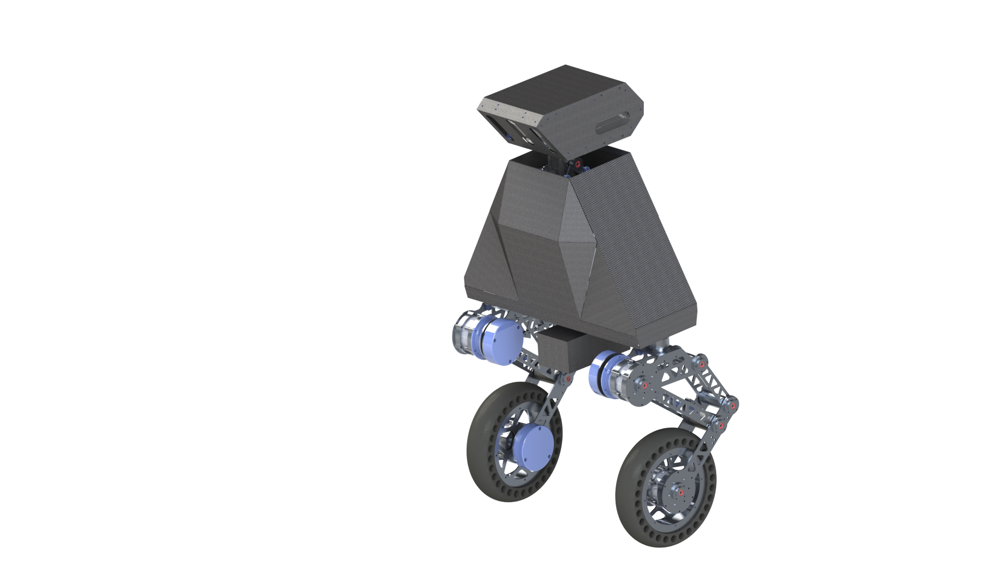
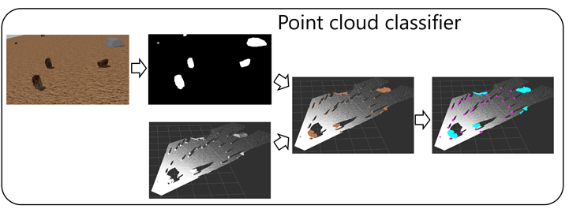

# point_cloud_classifier package

This package implements point cloud classification for a two-wheeled mobile
robot. It was developed for environments cluttered with obstacles, such as a
Mars-like surface with stones. Some stones are small enough to pass between the
robot wheels and legs; these are treated as passable obstacles. Larger stones
can damage the robot and are treated as unpassable obstacles.

The package segments stones in camera images with a convolutional neural
network, back-projects the segmentation masks into the camera point cloud, and
publishes a labeled point cloud with three semantic classes: environment,
passable obstacle and unpassable obstacle.

<figure>
    
    <div style="text-align: center;">
        <figcaption>Two wheeled robot</figcaption>
    </div>
</figure>

## Point cloud classification algorithm
<figure>
    
    <div style="text-align: center;">
        <figcaption>Point cloud classification algorithm</figcaption>    
    </div>
</figure>

The algorithm works as follows:

1. The robot cameras send RGB images and aligned point clouds to the system.
2. A convolutional neural network performs instance segmentation of the images.
   Each pixel is labeled as either stone or environment.
3. The package back-projects the segmented images onto the point cloud from the
   cameras. Points receive labels according to the pixels onto which they are
   projected.
4. The system estimates dimensions of each stone instance from its point
   coordinates, compares them with a threshold, and classifies the instance as
   a passable or unpassable obstacle.

The output is a point cloud labeled according to three classes: environment,
passable obstacle and unpassable obstacle.

## ROS interface

The `point_cloud_classifier` package initializes a
`point_cloud_classifier` node. For camera index `i`, its input topics are:

1. `/d435_i/color/image_raw`: RGB images.
2. `/d435_i/aligned_points`: aligned point cloud messages.
3. `/d435_i/color/camera_info`: camera intrinsics required for point cloud
   back-projection.
4. `/cam_base_i`: odometry information for coordinate transformation from the
   camera frame to the robot base frame.
5. `/cam_map_i`: odometry information for coordinate transformation from the
   camera frame to the map frame.

The camera index `i` is `1` for the first camera and `2` for the second
camera. To process two cameras, launch two `point_cloud_classifier` nodes with
different `camera` and `node_name` launch arguments.

The output topics are `/labeled_points_1` for the first camera and
`/labeled_points_2` for the second camera. Each topic publishes `PointsList`
messages with the following structure:

```
Header header
sensor_msgs/PointCloud2 point_cloud
TF tf
int16[] labels
```

- `header` is used for time synchronization between camera streams.
- `point_cloud` is the labeled point cloud created by the package.
- `tf` stores the coordinate transformation required by downstream nodes.
- `labels` is an array containing labels for the points in the segmented point
  cloud.

`TF` has the following structure:

```
float64[] position
float64[] orientation
```

These arrays contain position and orientation of one frame in another frame.

The package can also work in dataset preparation and training modes: it can
generate centered crops from original images and instance masks, and it can
train the neural network on the configured dataset.

## User manual

The `point_cloud_classifier.launch` file has the following input arguments:

1. `camera`: string argument indicating the camera stream. Use `first` for
   camera 1 and `second` for camera 2. Default: `first`.
2. `environment`: string argument. Use `flat` for flat environments and
   `unstructured` for environments with variable height and surface curvature.
   The package uses different approaches to filter segmentation errors in flat
   and unstructured environments. Default: `flat`.
3. `node_name`: string argument defining the ROS node name. When using two
   cameras, launch two nodes with different names. Default:
   `point_cloud_classifier_1`.

You can run the package separately launching the point_cloud_classifier.launch
file or include this file in another launch file with other package as in
the point_cloud_classifier_map_maker.launch file.

Before running the node you should build it. To do this:

1. Go to the `tmp` directory:

```
cd <path to the point cloud classifier package>/tmp
```

2. Specify the path to your catkin workspace in the `CATKIN_WS` variable in
   the `build_point_cloud_classifier.sh` file.

3. Run the `build_point_cloud_classifier.sh` file:

```
./build_point_cloud_classifier.sh
```

To build and run the package:

1. Go to the `tmp` directory.
2. Specify the path to your catkin workspace in the `CATKIN_WS` variable in
   the `run_point_cloud_classifier.sh` file.
3. Specify the launch file you want to run in the
   `run_point_cloud_classifier.sh` file via the

```
roslaunch point_cloud_classifier <launch file name>
```

4. Run the `run_point_cloud_classifier.sh` file:

```
./run_point_cloud_classifier.sh
```

## Config file setup

The `config.json` file defines the work of the package.

- `images_dir` defines the path to the dataset directory with images and their
  label masks.

The dataset has the following structure:

<pre>
├── root_dir
    ├── rgb
        ├── crops
        ├── train
        ├── val
    ├── instances
        ├── crops
        ├── train
        ├── val
</pre>

- `crop_images` defines whether to create crops from the dataset RGB images
  and label masks.
- `training` defines whether to train the model on a dataset.
- `testing` defines whether the package initializes the
  `point_cloud_classifier` node.

The `config.json` file contains the train, validation, test and model settings.
In the train settings you can define:
- a path to a directory where the package saves the results of training
- a path to a pretrained model if you want to tune on new epochs
- a path to the dataset dir
- size of the images the model are training on
- other standard settings as batch size, number of epochs, etc.

In the validation settings you can define:
- a path to the dataset dir
- a batch size
- a number of workers

In the test settings you can define:

- `save_input`: if `true`, during testing the package saves the input images in
  the directory defined in `input_save_dir`.
- `save_common_output`: if `true`, during testing the package saves the
  segmentation results with all instances in one image. The results are saved
  in `common_output_save_dir`.
- `save_instances_output`: if `true`, during testing the package saves the
  segmentation results with one instance per image. The results are saved in
  `instance_output_save_dir`.
- `checkpoint_path` defines the path to the trained model.
- size of the images the model is trying to segment

In the model settings you can define:
- the name of the model the package loads
- number of input and output channels

## Example dataset
[Link to the example dataset](https://drive.google.com/drive/folders/1Sf1ieWrjQcrqLab-tgpH-wCa0oQXlz9p?usp=sharing)
